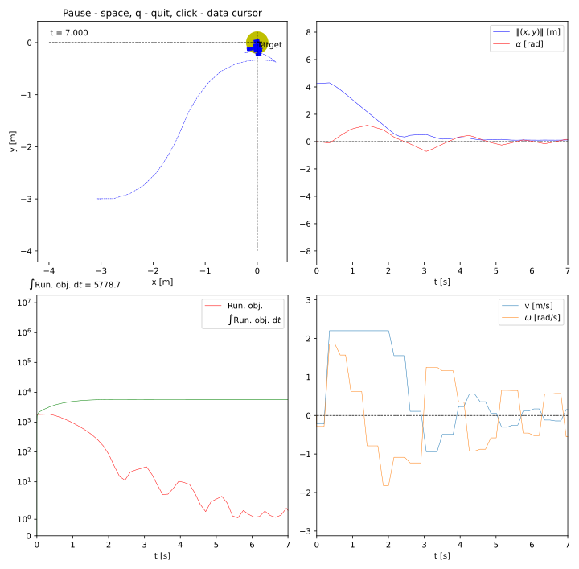

>**About**

 `rcognita` is a framework for dynamic programming and reinforcement learning algorithm development, testing, and simulation. The framework offers a playground of ready presets consisting of agents (controllers) and environments (dynamical systems). The core of the framework is `regelum` - a flexible universe of interconnected modules realizing a learn-in-the-loop concept, i.e., learning on the fly via data generated by the system. A distinct feature of `regelum` is that the controllers and systems exist in the same universe, allowing one to assemble a single preset combining both types of entities.

> **Table of Contents**

- [Introduction and Installation](#introduction-and-installation)
- [Re-produce some controllers](#re-produce-some-controllers)
  - [Nominal control](#nominal-control)
  - [Stanley Control](#stanley-control)
  - [MPC for Differential Drive](#mpc-for-differential-drive)
    - [MPC only](#mpc-only)
    - [MPC with obstacle avoidance](#mpc-with-obstacle-avoidance)
  - [Run Hyperparameters](#run-hyperparameters)
    - [Analyze logs](#analyze-logs)


# Introduction and Installation

[Introduction and Installation guildlines](docs\INTRODUCTION.rst)

# Re-produce some controllers
I created bash script where contains all the config. Users just need to run following bash script to launch according scenario

## Nominal control
```bash
# Run in Rcognita
source ./scripts/sim/launch_nominal.sh

# Run in Gazebo or Robot
source ./scripts/ros/launch_mpc.sh
```

Result in Rcognita:


Result in Gazebo:


Result in real world :


## Stanley Control
```bash
source ./scripts/sim/launch_stanley.sh
```

Result in Rcognita:


## MPC for Differential Drive
### MPC only
```bash
# Run in Rcognita
source ./scripts/sim/launch_mpc.sh

# Run in Gazebo or Robot
source ./scripts/ros/launch_mpc.sh
```

Result in Rcognita:


Result in Gazebo:


### MPC with obstacle avoidance
```bash
# Run in Rcognita
source ./scripts/sim/launch_mpc_obs_avoidance.sh

# Run in Gazebo or Robot
source ./scripts/ros/launch_mpc_obs_avoidance.sh
```

Result in Rcognita:


Result in Gazebo:


## Run Hyperparameters
With options like 
`"nominal"`
`"stanley"`
`"MPC_1"`
`"MPC_2"`
, we can run make run automatically several scenarios with different hyperparameters.

```bash
python run_PRESET.py <your_option>
```

Recordings:
`simdata`: store all of your logs used to generate figures.
`media`: store all of your figures generated by notebooks

### Analyze logs
These are notebooks analyzing the according hyperparameters options:
`"nominal"`: [check_data_log_Nominal.ipynb](notebooks/check_data_log_Nominal.ipynb)

`"stanley"`: [check_data_log_Stanley.ipynb](notebooks/check_data_log_Stanley.ipynb)

`"MPC_1"`: [check_data_log_MPC_onepose.ipynb](notebooks/check_data_log_MPC_onepose.ipynb)

`"MPC_2"`: [check_data_log_MPC_onepose_R1.ipynb](notebooks/check_data_log_MPC_onepose_R1.ipynb)

All images for validation are also mentioned in the notebooks.
